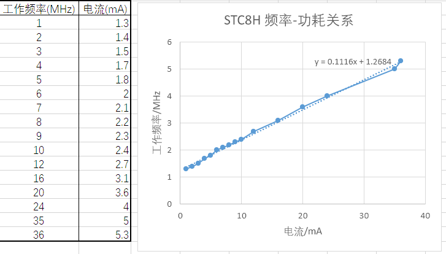

# STC8H1K08 功耗与频率关系
2024-04-19 23:00

为了确定STC8H系列的功耗，方便将来拿来做低功耗玩意，测试了STC8H1K08的功耗-频率关系。

测试电路图如下

随便选了一个例程测试，因为日后肯定要用到ADC，故选择带ADC的例程，具体代码没仔细看过

得到如下结果

从表格中可以看出来，该MCU的功耗和主频大致呈线性关系，每1MHz主频消耗约110uA的电流，有一些固定的电流消耗，在1.27mA左右

整体而言STC8H的功耗还是相对低的，看起来能胜任微型太阳能板的MPPT任务

另外，测试时候发现设置主频为30MHz时烧录不了，不清楚为什么，可能是刚好内部RC振荡器的几个频点都分不出合适的频率

~~p.s. 不喜欢用CSDN，又找不到合适的Blog网站，自己搭技术力不够，以后就把Blog堆在这里吧~~